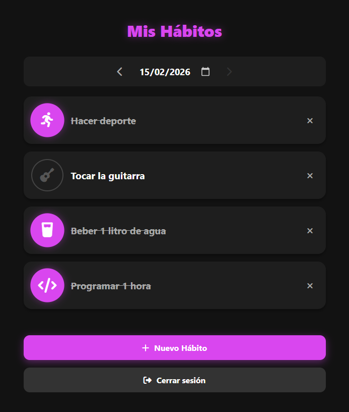
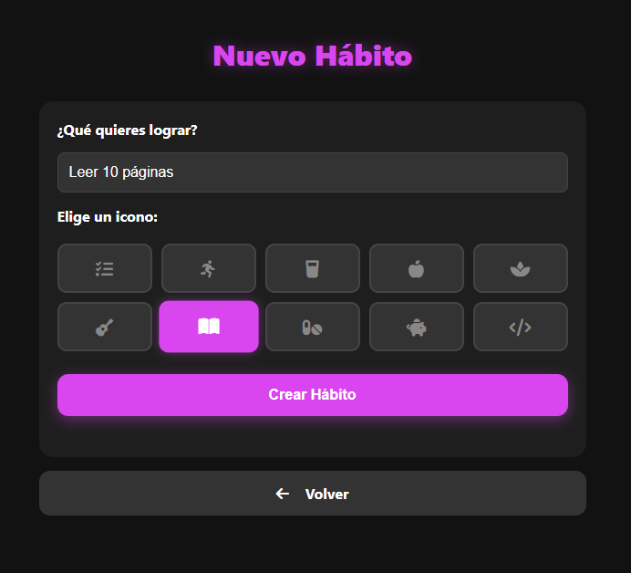
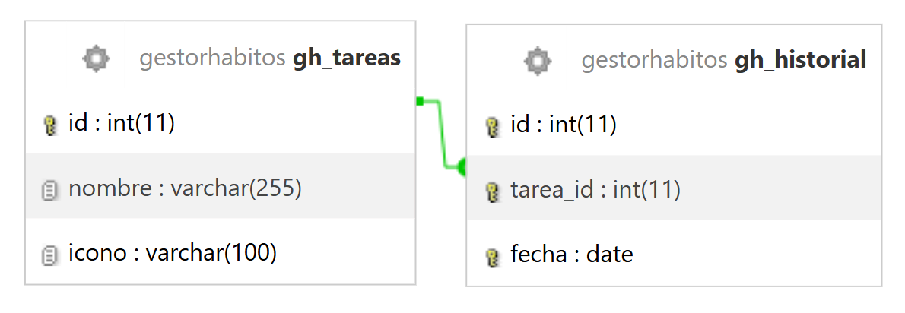

# ☑️ Gestor de Hábitos (Habit Tracker)

Aplicación web full-stack desarrollada en **PHP puro** orientada a la creación y seguimiento de hábitos diarios. Este proyecto destaca por su arquitectura limpia, separación de responsabilidades y diseño de interfaz (UI/UX) moderno.

## 📸 Vistas de la Aplicación

Aquí puedes ver el diseño de la interfaz principal y el formulario de creación:

| Vista principal | Creación de nuevo hábito |
| :---: | :---: |
|  |  |

## 🛠️ Tecnologías y Arquitectura

* **Backend:** PHP 
* **Base de Datos:** MySQL
* **Frontend:** HTML5, CSS3 (Vanilla), FontAwesome
* **Arquitectura:** MVC (Modelo-Vista-Controlador)
* **Seguridad:** Uso estricto de PDO con sentencias preparadas para prevenir Inyección SQL.

## ✨ Funcionalidades Principales

* **CRUD de Hábitos:** Creación de nuevos hábitos asignando iconos dinámicos (FontAwesome) y eliminación segura (con borrado en cascada del historial).
* **Tracking Diario:** Marcado y desmarcado de tareas por días.
* **Navegación Temporal:** Sistema de navegación intuitiva entre fechas (ayer, hoy, mañana) con bloqueo de fechas futuras por seguridad tanto en *Client-side* como en *Server-side*.
* **Diseño UI/UX:** Interfaz *Dark Mode* cuidada, interactiva y totalmente *Responsive*.

## 🗄️ Modelo de Datos (Esquema Relacional)

El sistema utiliza una base de datos MySQL con dos tablas conectadas mediante una relación `1:N` (un hábito puede tener múltiples registros de días completados).

**Detalles técnicos destacados:**
* **Borrado en cascada:** La clave foránea `tarea_id` cuenta con la restricción `ON DELETE CASCADE`. Si se elimina un hábito, todo su historial se limpia automáticamente para no dejar registros huérfanos.
* **Prevención de duplicados:** La tabla `gh_historial` tiene una clave `UNIQUE(tarea_id, fecha)` a nivel de base de datos, garantizando que sea imposible registrar el mismo hábito dos veces en el mismo día.

## 🚀 Instalación y Despliegue Local

1. Clonar el repositorio.
2. Importar el archivo `schema.sql` (ubicado en la raíz del proyecto) en tu servidor MySQL para generar la estructura de tablas necesaria.
3. Configurar las credenciales de conexión en `servicios/config.inc.php`.
4. Desplegar sobre un servidor local como XAMPP, MAMP o Docker.
